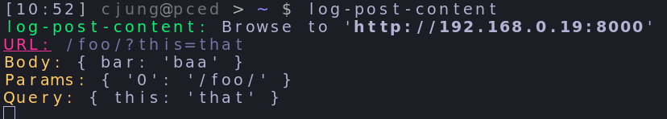

# log-post-content
A simple script to log all content of a POST request.

```
npm i -g log-post-content
log-post-content
```

If you want to start the server on the `9000` port for example just use this command:
```
PORT=9000 log-post-content
```

